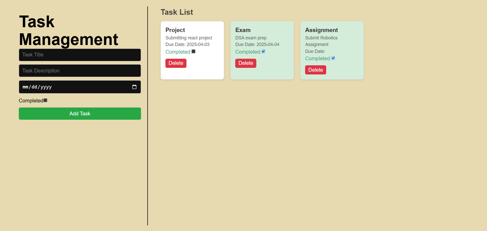

# Task Management Application

A simple task management app built with React, allowing users to create, update, and delete tasks.

## Features
- Add new tasks with a title, description, and due date.
- Toggle task completion status.
- Delete tasks when no longer needed.
- Responsive design: Form on the left, task list on the right.
  
## UI Review
  

## Installation  

1. Clone this repository:  
   ```sh
   git clone https://github.com/abdi-yz/task_manager_react.git
